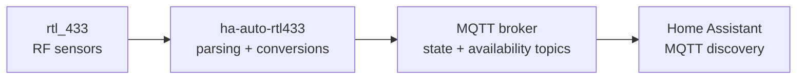

# ha-auto-rtl433


`ha-auto-rtl433` consumes the JSON stream produced by [`rtl_433`](https://github.com/merbanan/rtl_433) and exposes your wireless sensors to [Home Assistant](https://www.home-assistant.io/) through MQTT discovery.  
It loads a simple YAML file that describes your whitelist, translates each message into Home Assistant entities, and keeps the device state in sync.

## Features

- Auto-discovers Home Assistant entities from rtl_433 payloads.
- Applies flexible conversions using AviatorScript expressions.
- Keeps a lightweight yet resilient MQTT connection with automatic recovery.
- Leverages virtual threads for concurrent JSON decoding without blocking.

## Getting started in 60 seconds

```bash
git clone https://github.com/arethore/ha-auto-rtl433.git
cd ha-auto-rtl433
mvn package
java -jar target/ha-auto-rtl433-X.Y.Z-all.jar example_config/config.yaml
# where X.Y.Z is the version produced by Maven (see `target/`)
```



## How it works

1. The application launches the command configured under `rtl433.process` (for example `sudo rtl_433 -F json`).  
   In environments where rtl_433 already streams JSON elsewhere, the command can be any alternative, such as `nc` pointing to a remote host.
2. Every JSON line emitted by rtl_433 is parsed, matched against the configured whitelist, and converted into Home Assistant discovery payloads.
3. MQTT discovery entities are provisioned (or updated) under `homeassistant/<component>/<unique_id>/config`.  
   State updates are published to `rtl_433/devices/<model_haId>/<attribute>/state`, where `<model_haId>` is the sanitized combination of the rtl_433 `model` and the configured numeric `haId`.
4. A dedicated availability connection publishes `online`/`offline` to `rtl_433/service/status`, and each entity advertises this topic as its `availability_topic`.

The first execution should be run manually so that Home Assistant creates the devices with deterministic identifiers.  
You can then enable the `reconfigExisting` flag and run the service again (for example as a systemd unit).  
On the second run the application rewrites the discovery payloads with friendly names while preserving the same IDs.

## Prerequisites

- Java 21 or later
- An MQTT broker reachable from the host running the application
- An rtl_433 setup that can produce JSON (`rtl_433 -F json` or any equivalent stream)

## Configuration

An example configuration is provided in `example_config/config.yaml`:

```yaml
logback:
  level: info
  format: text
  timestamp: true
  color: true
  file: null
  # Example to switch to file logging with rotation:
  # file: /var/log/ha_auto_rtl433/ha_auto_rtl433.log
  # rolling_pattern: /var/log/ha_auto_rtl433/ha_auto_rtl433.%d{yyyy-MM-dd}.%i.log
  # max_file_size: 10MB
  # max_history: 14

mqtt:
  host: 192.168.30.3
  port: 1883
  username: mqtt
  password: password
  reconfigExisting: true
  queueCapacity: 256

rtl433:
  process: "sudo rtl_433 -F json"
  whitelist:
    - model: Esperanza-EWS
      haId: '001'
      rtl433Id: '001'
      name: Fridge Thermometer
      entities:
        - attribute: temperature_F
          rename: temperature_C
          name: Temperature
          type: sensor
          class: temperature
          unit: "°C"
          conversion: "round(((value - 32) * 5 / 9) * 10) / 10"
```

### Key sections

- **logback** – optional logging preferences. Leave `file` as `null` for console logging or supply a path plus rotation settings.
-   To log to disk with rotation, uncomment the example block in `example_config/config.yaml` and adjust the paths (`file`, `rolling_pattern`, `max_file_size`, `max_history`). The pattern shown creates `/var/log/ha_auto_rtl433/ha_auto_rtl433.log`, rotates daily or when the size exceeds 10 MB, and retains the last 14 archives.
- **mqtt** – connection credentials, the discovery reconfiguration toggle, and the back-pressure queue size for publishes.
- **rtl433.process** – command executed to obtain JSON lines. Arguments support standard quoting (`sudo rtl_433 -F json`, `"/usr/bin/rtl_433" "-F" "json"`), so you can keep complex invocations in a single string.
  For network relays, you can point to tools such as `nc 192.168.30.4 55000`.
- **rtl433.whitelist** – list of devices to expose. Each device entry declares a stable numeric Home Assistant identifier (`haId`) and the rtl_433 identifier it should match (`rtl433Id`). Each entity then specifies the component type (`sensor`, `binary_sensor`, …), the rtl_433 attribute to read, optional renaming/conversion, and metadata such as `device_class` or units.

### Entity configuration reference

For every entry in `rtl433.whitelist` you can describe one or more entities with the following keys:

| Field | Description |
|-------|-------------|
| `attribute` | Name of the rtl_433 field to extract from the JSON payload. |
| `rename` | Optional key used to publish state topics with a different name (useful when the attribute name changes after conversion, e.g. `temperature_F` → `temperature_C`). |
| `name` | Friendly name that appears in Home Assistant. |
| `type` | Home Assistant component type (`sensor`, `binary_sensor`, …). |
| `class` | Optional Home Assistant `device_class`. |
| `unit` | Unit of measurement for sensors. |
| `value_template` | Home Assistant Jinja template evaluated on the raw MQTT payload. Handy for binary sensors (`"{{ 'ON' if value | int == 1 else 'OFF' }}"`). |
| `conversion` | Expression evaluated **before** publishing using [AviatorScript](https://github.com/killme2008/aviatorscript). The environment exposes a `value` variable and a helper `round()` function for convenience. |
| `on_value` / `off_value` | Optional payloads for binary sensors when you prefer to map values before they reach Home Assistant. |

You can combine `conversion` and `value_template`: the conversion runs first in the JVM, then the resulting value is handed to Home Assistant which can still apply a template if desired.

## Building and running

```bash
mvn package
java -jar target/ha-auto-rtl433-0.0.1-SNAPSHOT.jar /path/to/config.yaml
```

## Service deployment tips

1. Run the application once manually without `reconfigExisting`. Confirm your devices appear in Home Assistant.
2. Enable `reconfigExisting: true` so the app refreshes friendly names and other metadata while keeping IDs stable.
3. Wrap the second run in your preferred service manager (systemd, Docker, supervisord, …). The built-in MQTT availability topic (`rtl_433/service/status`) helps you monitor uptime.

## License

This project is licensed under the [MIT License](./LICENSE) — see the file for details.

## Third-Party Licenses

This project uses open-source libraries under permissive licenses:

| Library                                                              | License    |
| -------------------------------------------------------------------- | ---------- |
| [JUnit 4.11](https://github.com/junit-team/junit4)                   | EPL 1.0    |
| [SnakeYAML 2.4](https://bitbucket.org/asomov/snakeyaml)              | Apache 2.0 |
| [Jackson Databind 2.17.2](https://github.com/FasterXML/jackson)      | Apache 2.0 |
| [Eclipse Paho MQTT 1.2.5](https://github.com/eclipse/paho.mqtt.java) | EPL 1.0    |
| [Aviator 5.4.1](https://github.com/killme2008/aviatorscript)         | Apache 2.0 |
| [SLF4J 2.0.13](https://www.slf4j.org/)                               | MIT        |
| [Logback Classic 1.5.6](https://logback.qos.ch/)                     | EPL 1.0    |

All listed licenses are compatible with the [MIT License](./LICENSE) of this project.

## Limitations / Known issues

- Currently, lost messages are not replayed after an MQTT reconnect.
- Future releases may include a persistent queue or replay buffer to mitigate this.

## Community

Feedback and pull requests are welcome, but please start with an issue describing your use case so we can align on the approach.
